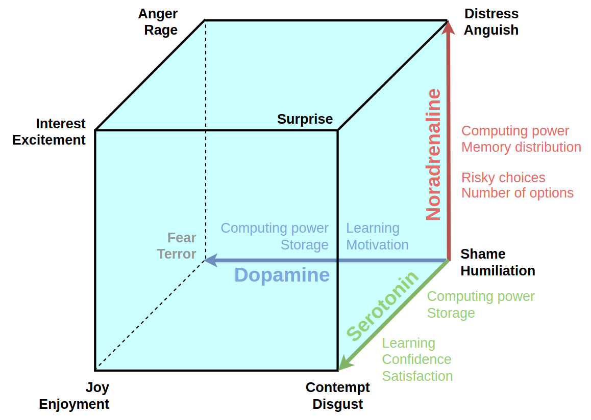

# Neuromodulating Cognitive Architecture project

## Problem

Starting from works of Darwin emotions attract a lot of attention of researchers especially in the field of psychology. The main reason for this interest seems to be obvious as emotions play crucial role in mammalian life. Starting from seminal works of Rosalind Picard "Affective computing" the ideas or the emotional recognition and the reimplementation of emotions in a computational machine are gaining their popularity. For some years the artificial intelligence systems were designed not taking in account any emotional influence over decision making and behavioral strategies of mammals instead the reasoning and machine learning approaches were introduced. Modern view on the role of emotions in a mammalian social life puts us in position to reimplement bio-plausible emotional drives in a computational system. 

"How can we make machine feel emotion" this is the key question of the project.
We have selected the ["cube of emotions"](https://en.wikipedia.org/wiki/L%C3%B6vheim_cube_of_emotion) as the neuro-psychological basement of our reimplementation project. It was published by Hugo Lövheim in 2012 and maps three monoamine neuromodulators: noradrenaline, serotonin, noradrenaline and basic emotional states (affects): fear, joy, disgust, humiliation, anger, interest, surprise, distress. We have extended the 3D model with the influence over computational processes based on role of neuromodulators. 

## Breakthrough
